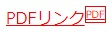

# 2018.12.18 授業内容

## 今日の耳より情報  
デジタル彼女。未来を見据えて色々やってみよう


## デフォルトCSS

デフォルトCSSとは、ブラウザがあらかじめ持っているCSS。  
このCSSにより、制作者がCSSを記述。しなくても最低限の見た目が保障される。  


### ResetCSSとは
Reset CSSっていうのは、Webページを読み込んだときに既定で適用されるスタイルをリセットするもの。  
色々な種類がある。  
変な余白等をリセットしてくれる。  
賛否がある。遅くなるなど。案件や会社によって合わせる。  
※ResetCSSを使うページ、使わないページがあるのはNG。  

ヤフーのサーバー上にあるResetCSS  
YUI  
https://yuilibrary.com/yui/docs/cssreset/

```css
<head>
<meta charset="UTF-8">
<title>デフォルトCSSについて</title>
<link rel="stylesheet" type="text/css" href="http://yui.yahooapis.com/3.18.1/build/cssreset/cssreset-min.css">
<link href="default.css" rel="stylesheet" type="text/css">
</head>
```


## スタイルシートの継承
### 要素の入れ子構造
```css
<body>
 <div>
 <p>
 現代人の<em>疲れ</em>の原因は？
 </p>
 </div>
</body>
```

### 要素のツリー構造
```css
<html>
 <head>
 <title>ツリー構造の例</title>
 <link href="css_cascading.css" rel="stylesheet" type="text/css" />
 </head>
 <body>
 <h1>見出し1</h1>
 <ul>
 <li>リストの中身</li>
 <li>リストの中身</li>
 </ul>
 <h2>見出し2</h2>
 <p>段落（<em>強調</em>）という構造。</p>
 </body>
</html>
```


### スタイルの継承

Cascading:階段状の、滝のような  
Style:見た目  
Sheets:紙  


親要素の指定定義が子要素に引き継がれる
※引き継がれないプロパティもあるので注意
文章系は引き継がれる
ボックス系は引き継がれない

|プロパティ| 継承|
|--|--|
|background-color| ×|
|border| ×|
|color| ○|
|font-size| ○|
|font-weight| ○|
|line-height| ○|
|margin| ×|
|padding| ×|
|text-align| ○|
|width| ×|


## グループ化用のHTMLタグ

### ブロックレベル要素としてグループ化


#### div要素
division：部分、段、節  
・改行される
・ブロックレベル要素

```css
<div id=”header”>ページ内のパーツをグループ化</div>
<div class=”content”>ページ内のパーツをグループ化</div>
<div id=”footer”>ページ内のパーツをグループ化</div>
```

#### 代表的な属性
 - id属性
	- 要素に名前をつける：同じファイル内に同名複数指定できない
 - class属性
	- 要素に名前をつける：同じファイル内に同名複数指定できる


#### id属性・class属性

 - 記述ルールに則っていれば属性値に好きな名前を指定できる
 - 基本的にすべての要素に記述できる
 - 記述ルール
 - 半角の英字、数字、-（ハイフン）、_（アンダーバー）のみ使用可能
 - 頭文字は必ず英字
 - 正しい属性値
 - id="header" id="news1" id="side_nav" id="menu-2"
 - 間違った属性値
 - id="ｈｅａｄｅｒ" id="1news" id="サイドナビ" id="menu*2"


#### ワンポイント
divはDivision（ディビジョン）の略です。  
div要素をむやみに多用する人のことを「div中（ディブチュウ）」と呼ばれることがあります。 


### インライン要素としてグループ化 

#### span要素
span：期間、範囲  
・見た目の変化なし  

```css
<p>東京の温度は<span>30度</span>です。</p>
<p>埼玉の温度は<span class=“pickup high”>32度</span>です。</p>
<p>千葉の温度は<span class=“pickup”>28度</span>です。</p>
```

 - id属性
	- 要素に名前をつける：同じファイル内に同名複数指定できない
 - class属性
	- 要素に名前をつける：同じファイル内に同名複数指定できる


## セレクタの種類

### idセレクタ

id属性名を使ってスタイル定義箇所を特定する  
idセレクタは「#」始まり  
①HTML文書の対象要素に id属性 を記述する  
<要素名 id=“id名”>対象コンテンツ</要素名>
<div id=“header”>ヘッダーパーツ群</div>

②idセレクタを使用してスタイルを定義する
```css
#id名 {
 プロパティ: 値;
}
```

```css
#header {
 color: red;
}
```
id属性の復習
・ID名に使用可能な文字種は半角アルファベット（a-z|A-Z）、半角数字（0-9）、ハイフン（-）、  
アンダースコア（_）、コロン（:）、ピリオド（.）のみ。  
・半角アルファベットから始めなければならない。  

### classセレクタ

class属性名を使ってスタイル定義箇所を特定する  
classセレクタは「.」始まり  
①HTML文書の対象要素に class属性 を記述する  
<要素名 class=“class名”>対象コンテンツ</要素名>  
<p class=“pickup”>ピックアップ項目</p>  


②classセレクタを使用してスタイルを定義する  
```css
.class名 {
 プロパティ: 値;
}
```
```css
.pickup {
 color: red;
}
```

CSSはclassのほうが管理しやすい。
JavaScriptはidを使うなどで管理する。

またclass名は以下のように半角スペースで複数のclass名を付けられる。  
```css
<p class="p1 pickup box">
```

idとclassの併用は可能
```css
<p id=“header” class="p1 pickup box">
```


### セレクタのグループ化

複数個所に同じスタイルを定義する場合グループ化できる  
グループセレクタは「,」で区切る  
```css
h1 {
 color: red;
}
h2 {
 color: red;
}

↓↓↓↓

h1, h2 {
 color: red;
}
```

divの開始と閉じが離れることがよくあるため、  
閉じdivにコメントでid名もしくはclass名を入れるとわかりやすい。  
```html
<div id="wrapper">
|
|
|
</div><!-- #wrapper -->
```

### 子孫セレクタ

対象要素内にある特定の要素を指定する  
対象セレクタを半角スペースで区切る  

```css
#header p {
 font-size: 20px;
}
```
id名「header」グループ内のp要素のみ対象になる。  
子孫セレクタを使用することでid名やclass名を最小限にできる。  


以下はfooterグループのul内のpのみに適用される。olのpには適用されない。  
```css
# footer ul p {
	font-size: 15px
}
```

```html
<div id="footer">
	<ul>
		<li>子孫セレクタテスト</li>
		<p>子孫セレクタテストだよ</p>
	</ul>
	<ol>
		<li>子孫セレクタテスト</li>
		<p>子孫セレクタテストだよ</p>
	</ol>
<div>
```

### a要素に対する擬似クラス

リンクの状態をあらわす擬似クラス  
a要素に対する擬似クラスは「a:状態」と指定  

■<strong>必ず以下の順番で記述</strong> ※省略は可  
上から順にスタイルを継承しているため。  
 - a:link
	- リンク先未訪問時のスタイルを定義
 - a:visited
	- リンク先訪問済時のスタイルを定義（セキュリティ上の理由でスタイル限定）
		※Firefox：背景色適用できない等
 - a:hover
	- リンク対象にカーソルが乗った時のスタイルを定義
 - a:active
	- ブラウザがリンク先にアクセスしている時のスタイルを定義

検証ツールでhoverとactive時のCSS情報が表示されない。
その場合、該当要素を選択して「:hov」を開き、hoverとactiveのチェックボックスをオン。

visitedに関して、以前は訪問済みのリンク文字は大きくするなどができたが、  
セキュリティの面から制限が強くなり色々自由にはできない。  


### ちょっと便利なセレクタ
a[href$=".pdf"]
後方一致。aのpdfファイルに対して有効という意味のセレクタとなる。


```css
.box2 li:first-child { / *box2グループの最初の行に対して */

	color: pink;
}

.box2 li:last-child { /* box2グループの最後の行に対して */

	color: gold;
}


.box2 li:nth-child(3) { /* box2グループの最後の行から三番目に対して */
	color: skyblue;
}
```
↓↓↓↓

```html
<ul class="box2">
  <li>項目１</li>
  <li>項目２</li>
  <li>項目３</li>
  <li>項目４</li>
  <li>項目５</li>
  <li>項目６</li>
</ul>
```

before:対象要素の前に追加  
after:対象要素の後に追加  
要素名::befor {  
	content:"    "; ← contentは必須
```css
a[href$=".pdf"]::after {
	content:"PDF";
	font-size: 60px;
	border: solid 1px;
	text-decoration: none;
	vertical-align: top;
}
```
↓↓↓
結果、HTML上の文字の後ろに定義したcontent及びスタイルが追加される。  
PDFリンク → PDFリンクPDF  



### 優先度のルール
対象の要素に対するCSS定義の優先度は以下。
優先度の低い定義内容は高い定義内容で上書きされる。

▲優先度が高い  
!important  
インライン方式で記述した定義(html内で定義したCSS)  
セレクタのポイントの高い定義  
下のほうに記述されている定義  
継承されてきた定義  
▼優先度が低い    
  
絞られれば絞られるほど優先度が高い。    
id > class そのためあまりidは使わない。    

CSSだけで画像スライドショーをやってみる  
https://q-az.net/slideshow-only-css/  


<a href="#">topへ</a>  
[ホーム](http://www.lamplus.ml/)