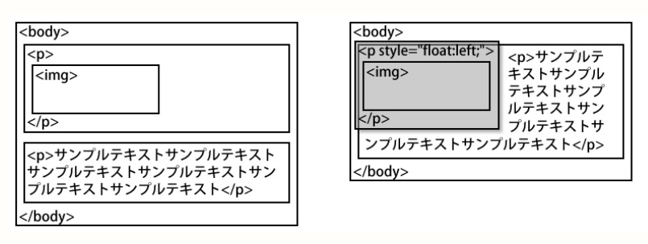

# 2018.12.19 授業内容


## 昨日の復習と続き  
  
  
検証ツールでelement.styleと書かれたものはインライン方式  
html内で外部CSSが上に記述、埋め込みCSSがその下に記述されている場合、埋め込みの勝ち。後勝ちとなる。  

以下の記述の場合、「p strong {」と「strong」では「p strong {」がポイントが高いため勝ち。

```html
<style type="text/css">
p strong {
	color: gray;
}

strong {
  color: green;
}
</style>
</head>
<body>
<p><strong style="color:red;">段落１</strong>のサンプルテキスト</p>

<p><strong>段落２</strong>のサンプルテキスト</p>

<p><strong>段落３</strong>のサンプルテキスト</p>
</body>
</html>
```

CSSでクラスを指定する場合、クラス名「a1」「a2」「a3」があるとして
```css
.a1.a2.a3{ → スペース無しはa1～a3が全部付与してあるクラスのみ

}

.a1 p{ → 間に半角スペースがあると子孫セレクタ

}
```


## CSSレイアウト

### 要素を浮かせて配置する

float: right;  

|値| 内容|
|--|--|
|left| 対象要素を左に浮かせて配置  後に続くコンテンツが右の空いたスペースに回り込む|
|right| 対象要素を右に浮かせて配置  後に続くコンテンツが左の空いたスペースに回り込む|
|none（初期値）| 浮かせて配置しない|


#### 要素の回り込み

HTMLの各要素は空いているスペースがある場合上へ移動しようとする。  
floatプロパティで対象要素を浮かせると、後に続く要素が上へ移動。  
上へ移動した要素内のコンテンツはfloatさせた要素の領域をさけて表示。  
floatプロパティは対象要素を浮かせるプロパティ。  
*※副産物として回り込みが発生。*  
画像が浮き、下に文章のある<p>の領域が潜り込むが、ブラウザが文章を見えるように回り込みさせている。

*■floatの特徴*  
領域が幅の中のコンテンツに応じて可変になる。  
上下マージンは加算になる。  
浮いていない要素からは認識されなくなる。（だから加算）  
浮かせた後に続く要素が空いたスペースに回り込む。（前の要素は回り込まない）  

  

### 回り込みの解除
clear: both;  
clearプロパティはfloatプロパティの指定により回りこんでしまった要素の回り込み解除を定義する。  

|値| 内容|
|--|--|
|left| float: left;により回り込んだ要素の回り込み解除|
|right| float: right;により回り込んだ要素の回り込み解除|
|both| 左右両方の回り込みを解除|
|none（初期値）| 回り込みの解除をしない|

ほぼbothしか使わない。


実習
最近のサイト幅はは960pxが多い。年度で変わるのでネットで調べてみよう。
左の題、写真、文書の開始位置は上から下まで揃えたほうがきれい。マージンで調整。

検証ツール右上の三点ツール→settings→Defoult indentationでcss内をコピーした時のスペース数を決定できる。
NetworkのDisable cashe(while DevTools is open)のチェックをオンにするとCSSをキャッシュしない。

floatで浮いたもの同士は認識する。
※フロート定義した要素の高さが計算されない
フロートで浮かせた要素の高さは計算されないため、  
後に続く要素にclearプロパティを定義して回り込み解除することをおすすめ。


### ■clearfixという方法
content領域(div id="content")内のすべてのコンテンツをfloatさせると、content領域の高さが0になる。
それを解決するためにClearfixという方法がある。
・floatによって高さが検出されないときに使用する。
・clearfixクラスはフロートをかけた要素の親につける

```css
.clearfix::after {
	content: ""; /* afterの後にはcontentは必須：空文字*/
	display: block; /* ブロックレベル要素として表示*/
	height: 0; /* ブロックレベル要素なら高さを設定可 */
	clear: both; /* 浮いた要素の下をくぐらない */
}
```
floatに代わるプロパティとしてflexが出てきている。  
今後はflexになるが、過去案件をいじるときにfloatはまだまだ使用しているため触る機会がある。  


### 表示方法の定義
display: block;
要素の表示方法を定義する。
displayプロパティはあくまでも表示方法の定義であり、要素の性質は変わらない


|値| 内容|
|--|--|
|block| ブロックレベル要素として表示（幅と高さの定義、改行）|
|inline| インライン要素として表示（横並び）|
|none| 非表示（印刷用CSSなどでメニューを非表示にしたりする）|

ほかにもある。


listでリンクを作る際は、<li>内の<a>要素を使うこと。<li>を指定すると文字外の領域がリンクにならない。  

サルワカのページで見出しの例がある。今なら読み解ける。  
https://saruwakakun.com/html-css/reference/h-design


<a href="#">topへ</a>  
[ホーム](http://www.lamplus.ml/)