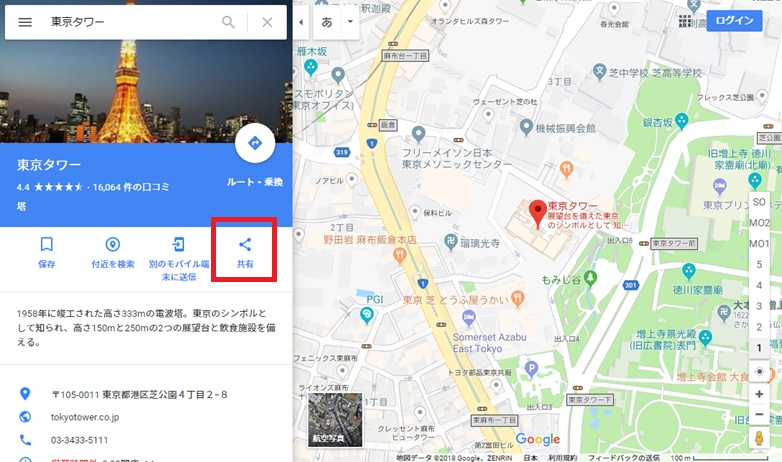
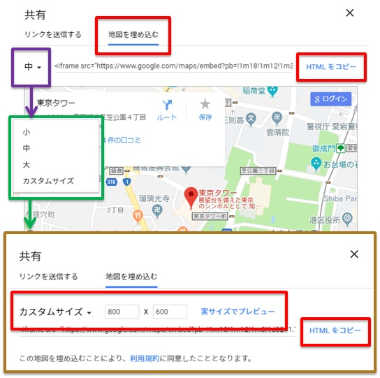

# 2018.12.19 授業内容


## 昨日の復習と続き
floatのおさらい

[floatおさらい問題](docs/osarai/おさらいfloat_ヒントあり.pdf)  
[問題1 html](docs/osarai/layout01.html) [問題1 css](docs/osarai/layout01.css)  
[問題2 html](docs/osarai/layout02.html) [問題2 css](docs/osarai/layout02.css)  
[問題3 html](docs/osarai/layout03.html) [問題3 css](docs/osarai/layout03.css)  
[問題4 html](docs/osarai/layout04.html) [問題4 css](docs/osarai/layout04.css)  
[問題5 html](docs/osarai/layout05.html) [問題5 css](docs/osarai/layout05.css)  

[回答1 html](docs/osarai/a_layout01.html) [回答1 css](docs/osarai/a_layout01.css)  
[回答2 html](docs/osarai/a_layout02.html) [回答1 css](docs/osarai/a_layout02.css)  
[回答3 html](docs/osarai/a_layout03.html) [回答1 css](docs/osarai/a_layout03.css)  
[回答4 html](docs/osarai/a_layout04.html) [回答1 css](docs/osarai/a_layout04.css)  
[回答5 html](docs/osarai/a_layout05.html) [回答1 css](docs/osarai/a_layout05.css)  


clearfixを反映させる要素は、flotをした要素の親要素。  
問題4について  
外枠可変、中枠固定の場合、ウィンドウ幅を小さくすると中枠の文字や枠が外枠から飛び出る。  
その場合 min-width を使うとよい。  
```css
body {
  background-color: #ccc;
  margin: 0;
  min-width: 1000px; → ウィンドウ幅1000px以下は1000で固定、以上は可変。max-widthもある。
}
```

親要素に幅を指定すると、子要素はウィンドウを小さくしてもカラム落ちしない。  
そのため親の要素のどこかに必ず基準枠、子要素が入る以上の枠を確保、指定すること。  

幅を可変にする場合は、width:auto;を使用する。width;100%だとマージン分が画面からでるため  
わずかな横スクロールバーがでる。  


### floatに代わる要素 flex
display: flex;

詳細はサンプルを見てみよう。  
[flexサンプル](docs/おさらいflex/index00.html)

flexの特徴  
 - 指定しなけらば、一番高い領域のコンテンツの高さに合わせる  


## SublimeText3をインストール、カスタマイズしてみよう  
ここから入れられるよ  
http://jobtech.jp/


### fontawesome
アイコンをWebフォントとして持ってくることができるサイト。  
有料と無料がある。  
https://fontawesome.com/  

手順  
 1 以下がからcssのURLリンクを取得してhtmlのヘッドタグに記載  
   [スタート](https://fontawesome.com/start)  
 2 好みのアイコンを開いて上部のiタグをコピーし、HTMLの挿入したい箇所へ張り付け  
 3 もしくは入れたいタグにclassを追加して、以下のようにCSSに記述  

```css
.test::before {
  font-family: "Font Awesome 5 Free", "Font Awesome 5 Brands";
  content: "\f0f9";
  color: deepskyblue;
}
```

### GoogleMap表示
 1 場所を検索して共有ボタンクリック


 2 サイズ指定後 iframeタグ を貼り付け



<a href="#">topへ</a>
[ホーム](http://www.lamplus.ml/)
